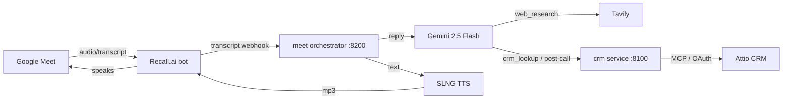
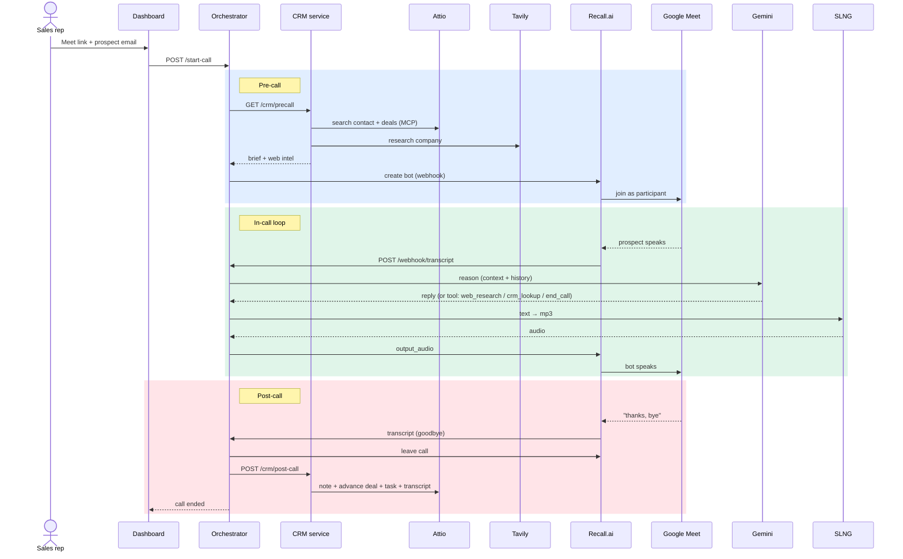

# CloserAI

**An autonomous AI sales agent that joins your live video calls, talks to the prospect in real time, researches them on the fly, and updates your CRM completely on its own.**

Built at the Tech:Europe London AI Hackathon.

CloserAI drops into a Google Meet as a real participant. It listens to the conversation, reasons with Gemini, speaks back with a natural voice, looks up live web intel and CRM facts mid-call, and — when the call wraps up — logs a note, advances the deal, creates a follow-up task, and saves the full transcript to the CRM. Zero clicks.

DEMO: https://youtu.be/r82SDw72QnI

---

## What it does

1. **Pre-call** — given a prospect's email, it builds a brief from the CRM (Attio) and live web research (Tavily) before the bot even joins.
2. **In-call** — it joins the Meet (Recall.ai), receives the live transcript, replies in ~1s with Gemini, speaks via SLNG, and can research the web or query the CRM when it needs a fact.
3. **Post-call** — it detects the goodbye, leaves on its own, then autonomously writes back to the CRM: summary note, deal stage advance, follow-up task, and the full transcript.

---

## Architecture



Two independent services that talk over HTTP:

| Service | Port | Responsibility |
|---------|------|----------------|
| **`crm/`** | 8100 | CRM brain — Attio (hosted MCP, OAuth) + Gemini over 37 Attio tools. Pre-call briefs, web research, autonomous CRM writes. |
| **`meet/`** | 8200 | Meet orchestrator — Recall.ai bot, live transcript, Gemini reasoning, SLNG voice, and a live web dashboard. Calls the CRM service. |

---

## Call flow

End-to-end lifecycle of a single sales call:



---

## Partner technologies

- **Attio** — CRM, driven entirely through its hosted **MCP** server over OAuth (no hand-written API calls).
- **Gemini** (`google-genai`, `gemini-2.5-flash`) — real-time reasoning, function calling, and call summaries. Thinking disabled for sub-second replies.
- **Tavily** — live web research on the prospect's company (news, funding, competitors).
- **SLNG** — natural text-to-speech (Deepgram Aura voice), rendered to MP3 for Recall.
## Other technology
- **Recall.ai** — sends the bot into Google Meet, streams audio.
---

## Quick start

### 1. Install

```bash
cd CloserAI
python3 -m venv venv && source venv/bin/activate
pip install -r requirements.txt
cp .env.example .env        # fill in the keys below
```

Requires `ffmpeg` on the PATH (SLNG audio is converted WAV→MP3):

```bash
brew install ffmpeg
```

### 2. Configure `.env`

```env
# Gemini (Google AI Studio / Developer API key)
GOOGLE_API_KEY=your_gemini_key
GEMINI_MODEL=gemini-2.5-flash

# Tavily (pre-call + in-call web research)
TAVILY_API_KEY=your_tavily_key

# Recall.ai (Google Meet bot)
RECALL_API_KEY=your_recall_key
RECALL_REGION=eu-central-1

# SLNG (text-to-speech)
SLNG_API_KEY=your_slng_key
SLNG_VOICE=aura-2-thalia-en

# Service wiring
CRM_URL=http://localhost:8100
PUBLIC_URL=                      # public https URL of the orchestrator (for Recall webhooks)
```

Attio needs **no API key** — the CRM service authenticates to Attio MCP via OAuth (a browser login opens once on first run; the token is cached in `.attio_mcp_token.json`).

### 3. Run the three processes

```bash
# Terminal 1 — CRM brain
uvicorn crm.service:app --port 8100

# Terminal 2 — public tunnel so Recall.ai can reach the transcript webhook
cloudflared tunnel --url http://localhost:8200 --protocol http2
#   copy the printed https URL into PUBLIC_URL in .env

# Terminal 3 — Meet orchestrator
uvicorn meet.app:app --port 8200
```

Open the dashboard at **http://localhost:8200**, paste a Google Meet link and a contact email, and hit **Start Call**.

---

## The `crm` service (port 8100)

A self-contained CRM brain. It reasons over Attio's hosted MCP tools with Gemini — searching contacts and deals, logging notes, creating tasks, advancing stages — all in natural language.

| Endpoint | Purpose |
|----------|---------|
| `GET /health` | liveness |
| `GET /crm/context?email=` | pre-call brief from the CRM |
| `GET /crm/precall?email=` | brief **+** Tavily web intel |
| `POST /crm/ask` `{"query": "..."}` | any CRM action/question in plain English |
| `POST /crm/post-call` `{"email","summary","task"}` | autonomous wrap-up: note + deal advance + task |

Example:

```bash
curl "http://localhost:8100/crm/precall?email=sarah@brightwave.com"
```
```json
{
  "email": "sarah@brightwave.com",
  "brief": "Sarah Chen, Head of Revenue Operations at BrightWave SaaS. Open deal: CloserAI Growth (In Progress, $72,000). Most recent note: ready to move forward.",
  "web_intel": "WEB INTEL (Tavily): Brightwave Secures $15M Series A ..."
}
```

### As a Python library

```python
from crm import CRMAgent

async with CRMAgent() as agent:
    brief  = await agent.get_context("sarah@brightwave.com")
    result = await agent.ask("Create a task to follow up with Sarah in 2 days")
    print(result["answer"], result["tool_calls"])
```

---

## The `meet` orchestrator (port 8200)

Wires Recall.ai transcript → Gemini reasoning → SLNG voice, with a live dashboard.

| Endpoint | Purpose |
|----------|---------|
| `GET /` | control dashboard (pre-call brief + live conversation feed) |
| `POST /start-call` `{"meeting_url","contact_email"}` | build brief, send the bot to the Meet |
| `POST /say/{bot_id}` `{"text"\|"prompt"}` | make the bot speak exact text, or let it reason |
| `GET /history/{bot_id}` | live conversation memory (`active` flag) |
| `POST /end-call/{bot_id}` `{"summary","task"}` | end + autonomous CRM wrap-up |
| `POST /leave/{bot_id}` | leave immediately (no CRM writes) |
| `POST /webhook/transcript` | Recall.ai real-time transcript sink |

During a call the agent has a small toolset it uses only when needed:
- **`web_research`** — fresh external facts via Tavily
- **`crm_lookup`** — a specific CRM detail via the CRM service
- **`end_call`** — wrap up autonomously when the conversation is clearly over

Goodbye is also detected deterministically, so the bot never lingers.

---

## Repo layout

```
CloserAI/
├── crm/                # CRM brain (Attio MCP + Gemini)
│   ├── agent.py        # CRMAgent: get_context, precall, ask, post_call
│   ├── service.py      # FastAPI service (:8100)
│   ├── oauth.py        # Attio MCP OAuth + schema conversion
│   ├── research.py     # Tavily web research
│   └── config.py
├── meet/               # Meet orchestrator (:8200)
│   ├── app.py          # fast_reply, transcript webhook, wrap-up, dashboard
│   ├── recall.py       # Recall.ai bot: create, speak, leave
│   ├── slng.py         # SLNG TTS (WAV→MP3 via ffmpeg)
│   └── static/dashboard.html
├── docs/INTEGRATION.md
├── requirements.txt
└── .env.example
```

---

## Tech

FastAPI · httpx · Attio MCP (OAuth) · `google-genai` (Gemini 2.5 Flash) · Tavily · Recall.ai · SLNG · ffmpeg · cloudflared
